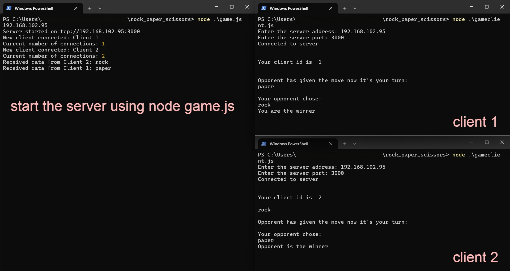

# rock_paper_scissors
This is a rock_paper_scissors cli game made with the help of net module in nodejs

start the game server:
```
node game.js
```
connect to the game server:
```
node gameclient.js
```
It will ask the address and the port of the server where you want to connect to

you can enter the ip address of the server

following commands to check the ip address of the server type the following in the server machine

### For Windows
```
ipconfig
```

### For Unix based systems
```
ifconfig
```
For Port enter <b>3000</b>

### This is a Demo screenshot

